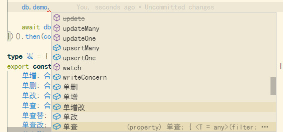

# snoMongoKu

a wrapper to mongodb driver, provide simple method in chinese to handle the mongodb.

Just have fun with chinese programming ~

## Usage

`npm i sno-mongo-ku`

### 1. Insert and print

These examples have the same purpose:
1. clean db
2. insert a log
3. print it out.

```typescript
import snoMongoKu from 'sno-mongo-ku'
; (async()=>{
    const db = await snoMongoKu('mongodb://localhost:27017/test-snomongoku')
    await db.logs.drop()
    await db.logs.insertOne({ createdAt: new Date(), content: 'test/(20210304)' })
    console.table( await db.logs.find().toArray() )
    // await db._client.close() // optional
})()
```

```typescript
import snoMongoKu from 'sno-mongo-ku'
; (async()=>{
    const db = await snoMongoKu('mongodb://localhost:27017/测试-雪芒果库')
    await db.日志.销毁()
    await db.日志.单增({ 创建于: new Date(), 内容: '测试/(20210304)' })
    console.table( await db.日志.多查列() )
    // await db._client.close() // optional
})()
```

### 2. upsert

```typescript
import snoMongoKu from 'sno-mongo-ku'
const db = await snoMongoKu('mongodb://localhost:27017/test-snomongoku')
await db.logs.drop()
await db.logs.upsertOne({_id: 'test', createdAt: new Date(), content: 'test/(20210304)' })
console.table( await db.logs.find().toArray() )
// await db._client.close() // optional

```

```typescript
import snoMongoKu from 'sno-mongo-ku'
const db = await snoMongoKu('mongodb://localhost:27017/测试-雪芒果库')
await db.日志.销毁()
await db.日志.单增改({_id: 'test', 创建于: new Date(), 内容: '测试/(20210304)' })
console.table( await db.日志.多查列() )
// await db._client.close() // optional

```

### 3. 并行各改

```typescript
import snoMongoKu from 'sno-mongo-ku'
const db = await snoMongoKu('mongodb://localhost:27017/测试-雪芒果库')
await db.日志.并行各改((日志)=>({$inc: 1}), {$match: {}})
console.table( await db.日志.多查列() )
```


### 4. More...

The `db._` you have got is just a alias of `client.db.collection($)`, which supports all MongoDB driver's collection methods, feel free to play with it.

For further usages, you can simply type `db._` and press `ctrl + space` on vscode to view how to use them on below.

Methods: `单增 单删 单改 单查 单查替 单查改 单查删 单补 单增改 upsertOne 多增 多删 多改 多查 多查数 多查列 多补 多增改 upsertMany 聚合 索引 索引删 复索引 复索引删 状态 数量估计 监视 改名 名称 去重 销毁`

Just like this:

## ref

- [自动化发布npm包及生成Github Changelog]( https://banyudu.com/posts/auto_publish_npm_and_generate_github_changelog.882513 )